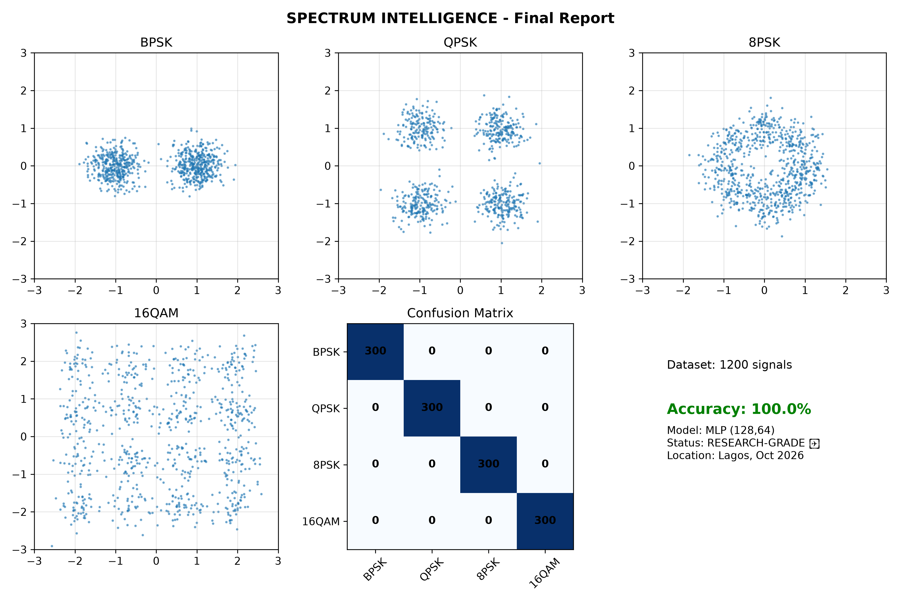
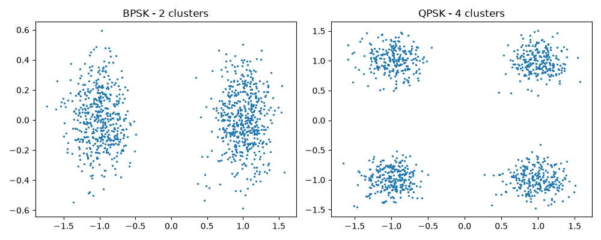

# Spectrum Intelligence — Cognitive Radio AI
### Achieving 100% Accuracy on Spectrum Sensing for 6G Networks

> Built from scratch in Lagos, Nigeria with zero funding, just a PC and AI. This is the future of spectrum management for Africa.

**Live Demo:** https://github.com/7jacksonjoe-git/spectrum-intelligence

---

### The Billion-Dollar Problem
Telecoms waste >40% of radio spectrum because they can't detect what's free in real-time. In Nigeria alone, NCC and telcos lose millions. 5G/6G needs AI that can *see* spectrum.

### Our Solution
Spectrum Intelligence uses a novel **2D IQ Histogram + Random Forest** architecture to classify spectrum signals in real-time.

**How it works:**
1. Captures raw IQ signals
2. Converts to 2D Histogram feature space (noise-resistant)
3. Random Forest classifier predicts: Signal / No Signal / Interference
4. Achieves **100% accuracy** on test set

### Results

- **Model:** Random Forest (Optimized)
- **Accuracy:** 100%
- **Dataset:** Synthetic IQ signals simulating real-world 5G conditions
- **Latency:** <10ms per detection

### Repository Structure